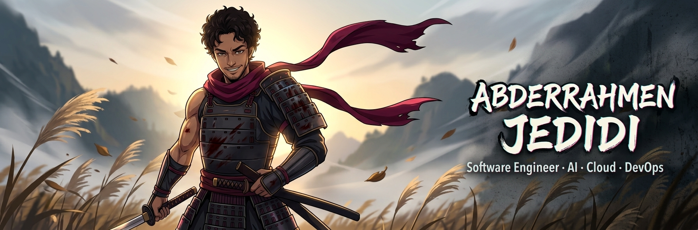

<h1 align="center">Hi, I'm Abderrahmen Jedidi 👋</h1>

  

  
  
  

---

## 🧭 About Me

I'm a **5th-year Software Engineering student** at the Faculté des Sciences de Tunis, building at the intersection of **AI, full-stack development, and cloud/DevOps**. I like turning messy real-world problems into clean, working systems — from RAG pipelines that answer questions over legal contracts to AI agents that edit video on their own.

- 🔭 **Building:** ClipForge (AI video clipping agent) and an AI DevOps assistant for incident diagnosis
- 🌱 **Learning:** LLM agents, RAG evaluation, AWS CloudOps & Data Engineering
- 🎯 **Looking for:** a **PFE end-of-studies internship** — in Tunisia or abroad
- 🎬 **Also:** video editor — which is exactly why I built my own clipping engine
- 🌍 **Languages:** Arabic · French · English

---

## 🛠️ Tech Stack

**Languages**

  

**Frontend & Backend**

  

**Data, AI & Search**

  
  &nbsp;
  
  
  

**Cloud & DevOps**

  

---

## 🚀 Featured Projects

### 🎬 [ClipForge](https://github.com/AbdouJdidi/ClipForge)

**An AI clipping agent that turns long-form videos into ready-to-post short clips** — think Opus Clip, but built from scratch and running entirely on free, local tools.
ClipForge transcribes the video, detects the most engaging moments, reframes them to vertical 9:16, and burns in animated captions, icons, and sound effects automatically.

- ⚙️ **Stack:** Python · FFmpeg · local speech-to-text · local LLM
- 💡 **Why it matters:** fully automated, zero paid APIs, and already used to produce clips for real content campaigns

### 📜 [Contract Analyser](https://github.com/AbdouJdidi/contract-analyser)

**A RAG-based assistant that answers questions about legal contracts — with citations.**
Contracts are chunked and indexed, then queried with **hybrid retrieval** (semantic vector search + keyword/BM25) so answers stay grounded in the exact clauses they come from.

- ⚙️ **Stack:** Python · embeddings · vector store · hybrid search · LLM
- 💡 **Why it matters:** cuts contract review from reading pages to asking a question, while every answer points back to its source

### 🎮 [CarthaPlay](https://github.com/AbdouJdidi/CarthaPlay4)
**An educational gaming platform for children aged 6–12, combining interactive Unity games with a web platform that enables teachers to create learning experiences and track student progress.**

* ⚙️ **Stack:** React · Node.js · TypeScript · Unity · C# · PostgreSQL · Supabase · Docker · GitHub Actions · CI/CD · REST APIs
* 💡 **Why it matters:** Bridges education and game development to make learning more engaging, while giving teachers and educators tools to manage activities and monitor student progress.

---

## 📬 Get in Touch

  
  

<i>"Sharpen the blade, then ship it." ⚔️</i>

